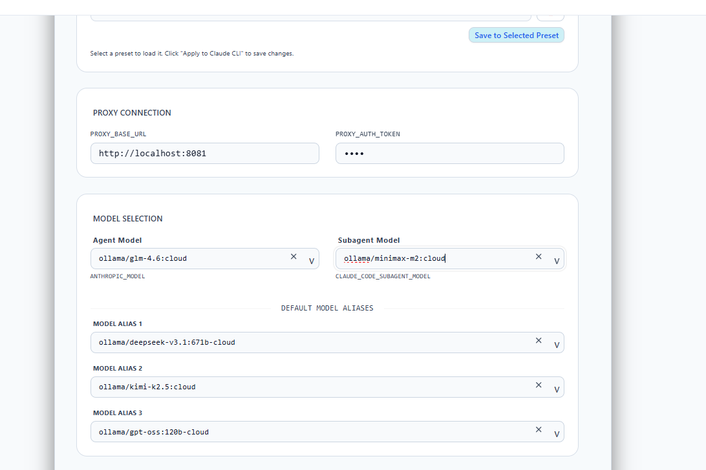
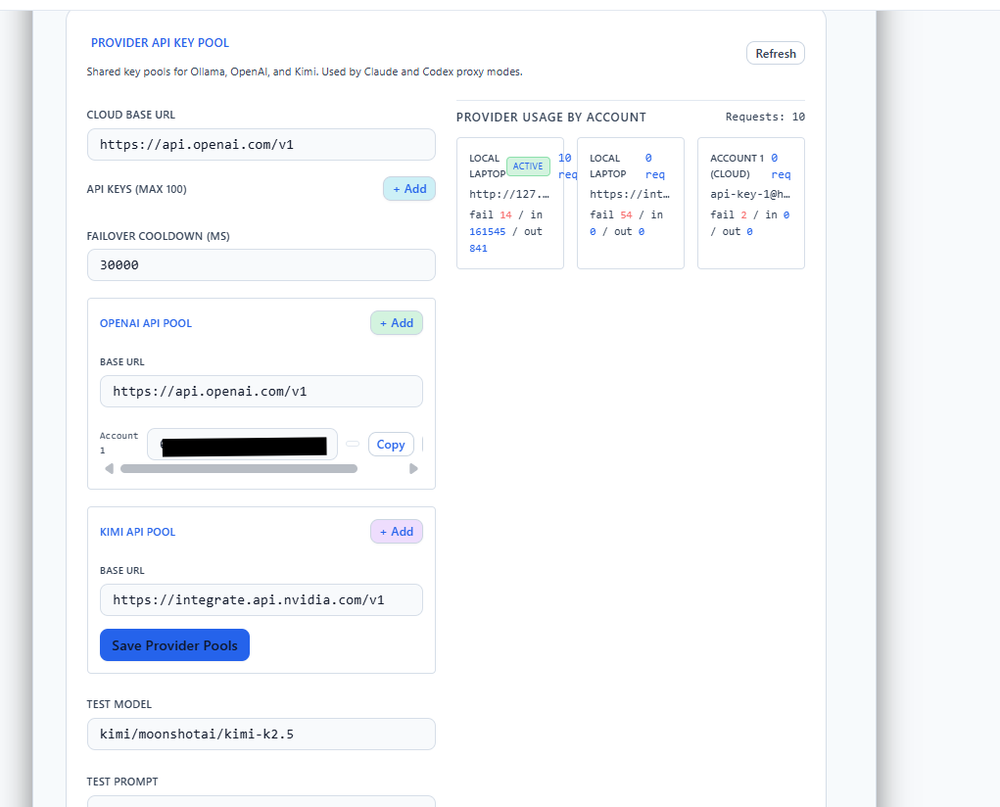

<div align="center">



# Model Hub

**Unified AI model gateway — Claude, Gemini, Ollama, OpenAI, Kimi through one API**

[](https://nodejs.org)
[](LICENSE)
[](https://github.com/thyjeff/model-hub/stargazers)
[](https://github.com/thyjeff/model-hub)
[](#)
[](#)
[](#)

</div>

---

<div align="center">

</div>

<br/>

<div align="center">

</div>

---

## ⚡ Quick Start — 3 commands

Works on **Windows**, **Linux**, and **macOS** — exactly the same commands.

```bash
git clone https://github.com/thyjeff/model-hub.git
cd model-hub
npm install && npm start
```

Then open **http://localhost:8080** — the dashboard guides you through the rest.

> **Requires:** [Node.js 18+](https://nodejs.org) and [Git](https://git-scm.com)

---

## 🔌 What is Model Hub?

```
Your AI Client  →  Model Hub  →  Google Cloud Code  (Claude + Gemini, free)
  (Claude Code,                →  Ollama            (local models)
   Cursor, Codex)              →  OpenAI API
                               →  Kimi API
```

Model Hub exposes a single **Anthropic-compatible API** on `localhost:8080`.
Any tool that talks to Claude works instantly — no code changes needed.

**Features:**
- 🆓 Free Claude & Gemini via Google Cloud Code (just a Google account)
- 🔄 Multi-account rotation — add multiple accounts, quotas auto-rotate
- 📊 Web dashboard — live quota bars, usage charts, account health, real-time logs
- 🦙 Ollama passthrough — use local models via `ollama/model-name`
- 🔑 OpenAI & Kimi — use `openai/gpt-4o` or `kimi/kimi-k2` as drop-in models
- ⚖️ Smart load balancing — hybrid health/quota/LRU strategy

---

## 👤 Add Your First Account

After `npm start`, open **http://localhost:8080** → **Accounts** → **Add Account** → sign in with Google.

**No browser / headless server?**
```bash
npm run accounts:add -- --no-browser
```

Add multiple accounts for higher combined quota — Model Hub rotates automatically.

---

## 🔌 Connect Claude Code CLI

Create or edit `~/.claude/settings.json`
(Windows: `%USERPROFILE%\.claude\settings.json`):

```json
{
  "env": {
    "ANTHROPIC_AUTH_TOKEN": "any-value",
    "ANTHROPIC_BASE_URL": "http://localhost:8080",
    "ANTHROPIC_MODEL": "claude-sonnet-4-5-thinking",
    "ANTHROPIC_DEFAULT_OPUS_MODEL": "claude-opus-4-6-thinking",
    "ANTHROPIC_DEFAULT_SONNET_MODEL": "claude-sonnet-4-5-thinking",
    "ANTHROPIC_DEFAULT_HAIKU_MODEL": "claude-sonnet-4-5",
    "CLAUDE_CODE_SUBAGENT_MODEL": "claude-sonnet-4-5-thinking",
    "ENABLE_EXPERIMENTAL_MCP_CLI": "true"
  }
}
```

Then run `claude` — it routes through Model Hub automatically.

> `ANTHROPIC_AUTH_TOKEN` can be **any non-empty string** — Model Hub handles real auth via Google OAuth.

---

## 📦 Available Models

| Prefix | Example | Backend |
|--------|---------|---------|
| _(none)_ | `claude-sonnet-4-5-thinking` | Google Cloud Code (free) |
| _(none)_ | `claude-opus-4-6-thinking` | Google Cloud Code (free) |
| _(none)_ | `gemini-3.1-pro-high` | Google Cloud Code (free) |
| `ollama/` | `ollama/llama3.2` | Local Ollama |
| `openai/` | `openai/gpt-4o` | OpenAI API |
| `kimi/` | `kimi/kimi-k2` | Kimi API |

```bash
# See all live models
curl http://localhost:8080/v1/models
```

---

## ⚙️ Configuration

Create a `.env` file in the project root (never committed):

```env
PORT=8080
API_KEY=optional-password
OLLAMA_BASE_URL=http://127.0.0.1:11434
OPENAI_API_KEYS=sk-...
KIMI_API_KEYS=your-key
GOOGLE_CLIENT_ID=your-client-id
GOOGLE_CLIENT_SECRET=your-client-secret
```

Or copy `config.example.json` → `~/.config/modelhub-proxy/config.json`.

---

## 🎛️ Strategies

```bash
npm start -- --strategy=hybrid       # Default: smart health + quota + LRU
npm start -- --strategy=sticky       # Best for prompt caching
npm start -- --strategy=round-robin  # Max throughput
npm start -- --fallback              # Auto-fallback when quota hits
```

---

## 🔑 API Endpoints

| Endpoint | Description |
|----------|-------------|
| `GET  /health` | Account pool status |
| `GET  /account-limits` | Per-account quota (JSON) |
| `GET  /account-limits?format=table` | Per-account quota (ASCII table) |
| `POST /v1/messages` | Anthropic Messages API |
| `POST /v1/chat/completions` | OpenAI Chat API |
| `GET  /v1/models` | List all available models |

---

## 🔒 Security

- **No API keys hardcoded** — all credentials load from env vars or local `config.json`
- **`.env` is gitignored** — secrets stay on your machine only
- **OAuth tokens** stored only in `~/.config/modelhub-proxy/accounts.json` locally
- **`ANTHROPIC_AUTH_TOKEN`** in Claude settings is just a placeholder — real auth is Google OAuth

---

## 🛠️ Troubleshooting

**"No accounts available"**
→ Open http://localhost:8080 → Accounts → Add Account

**Port already in use**
→ `PORT=3001 npm start`

**Claude Code asks for login**
→ Add `"hasCompletedOnboarding": true` to `~/.claude.json`, restart terminal

**Windows: native module error**
→ `npm rebuild` then `npm start`

**npm package not found**
→ The package isn't on npm — use the git clone method:
```bash
git clone https://github.com/thyjeff/model-hub.git
cd model-hub
npm install && npm start
```

---

## 📄 License

MIT — see [LICENSE](LICENSE)

---

<div align="center">
<strong>Model Hub</strong> — One gateway, all models.<br/>
<a href="https://github.com/thyjeff/model-hub/issues">Report a bug</a> · <a href="https://github.com/thyjeff/model-hub/issues">Request a feature</a>
</div>
